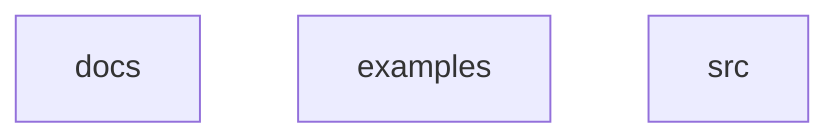

# Architecture

## Tech Stack

**Languages:** TypeScript

## System Diagram

## Modules

### `docs/`

Documentation

- **Files:** 5

### `examples/`

Contains examples-related files

- **Files:** 2

### `src/`

Application source code

- **Files:** 7
- **Sub-modules:** `action`, `cli`, `generators`

## Dependencies

- **Production:** 6 packages
- **Development:** 2 packages

### Key Dependencies

| Package | Version |
|---------|---------|
| @actions/core | ^1.10.1 |
| @actions/exec | ^1.1.1 |
| @actions/github | ^6.0.0 |
| chalk | ^4.1.2 |
| commander | ^11.1.0 |
| glob | ^10.3.10 |

---
*Auto-generated by [auto-doc-action](https://github.com/martinanatale/auto-doc-action) on 2026-03-13*